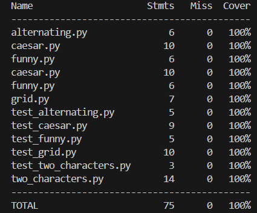

# String Algorithm Testing Project

String Algorithm Testing ด้วย Python และ Pytest

โดย นางสาวกรวรรณ ลีเลิศวงศ์สกุล เลขนักศึกษา : 6810110005

## วัตถุประสงค์

โปรเจคนี้จัดทำขึ้นเพื่อพัฒนาและทดสอบอัลกอริทึมที่เกี่ยวข้องกับ String โดยใช้ภาษา Python และใช้เครื่องมือ Pytest ในการทดสอบ เพื่อให้มั่นใจว่าอัลกอริทึมทำงานได้อย่างถูกต้อง และไม่มีข้อผิดพลาด (Defect) โดยมีการวัด Test Coverage ให้ได้ 100% ตามข้อกำหนดของ Assignment


## อัลกอริทึมที่พัฒนา

ในโปรเจคนี้ประกอบด้วยอัลกอริทึมทั้งหมด 5 โปรแกรม ได้แก่

### 1. alternating.py

อัลกอริทึมสำหรับตรวจสอบและลบตัวอักษรที่ซ้ำติดกัน เพื่อให้ String มีรูปแบบสลับตัวอักษร

### 2. caesar.py

อัลกอริทึม Caesar Cipher สำหรับเข้ารหัสข้อความ โดยการเลื่อนตัวอักษรตามจำนวนตำแหน่งที่กำหนด

### 3. funny.py

อัลกอริทึม Funny String ใช้ตรวจสอบว่า String มีรูปแบบความแตกต่างของ ASCII เท่ากันเมื่ออ่านจากหน้าและหลัง

### 4. grid.py

อัลกอริทึม Grid Challenge ใช้ตรวจสอบว่าเมื่อเรียงตัวอักษรในแต่ละแถวแล้ว คอลัมน์ยังเรียงตามลำดับตัวอักษรหรือไม่

### 5. two_characters.py

อัลกอริทึม Two Characters ใช้หาความยาวสูงสุดของ String ที่ประกอบด้วยตัวอักษรเพียง 2 ตัว และต้องสลับกัน


## การทดสอบโปรแกรม (Testing)

ใช้เครื่องมือ

* pytest
* pytest-cov

ในการทดสอบโปรแกรม

โดยมีการสร้าง Test Case ครบทุกเงื่อนไข ได้แก่

* กรณีปกติ
* กรณีผิดเงื่อนไข
* กรณีขอบเขต (Boundary case)


## ผลการทดสอบ

ผลการทดสอบมี Test Coverage = 100%

แสดงว่า

* ทุกบรรทัดของโปรแกรมถูกทดสอบ
* ไม่มีข้อผิดพลาดในการทำงาน


## Test Coverage Result




## โครงสร้างโปรเจค

```
string-algorithm-testing
│
├── alternating.py
├── caesar.py
├── funny.py
├── grid.py
├── two_characters.py
│
├── test_alternating.py
├── test_caesar.py
├── test_funny.py
├── test_grid.py
├── test_two_characters.py
│
└── README.md
```

## เครื่องมือที่ใช้

* Python 3.11
* Pytest
* Pytest-cov
* Git
* GitHub


## การใช้ Git

โปรเจคนี้ใช้หลักการ

Commit Early and Commit Often

โดยมีการ commit ทุกครั้งเมื่อ

* สร้าง algorithm
* เพิ่ม test case
* แก้ไขข้อผิดพลาด
* เพิ่ม README

เพื่อให้สามารถติดตามการพัฒนาได้อย่างชัดเจน


## วิธีรันโปรแกรม

ติดตั้ง pytest

```
pip install pytest pytest-cov
```

รัน test

```
python -m pytest --cov
```

---

## สรุปผล

จากการพัฒนาและทดสอบพบว่า

* โปรแกรมสามารถทำงานได้ถูกต้อง
* Test Coverage เท่ากับ 100%
* สามารถมั่นใจได้ว่าอัลกอริทึมไม่มีข้อผิดพลาด


## การใช้ Git 

โปรเจกต์นี้ใช้ Git ในการควบคุมเวอร์ชัน โดยใช้หลักการ

Commit Early and Commit Often

เพื่อบันทึกการพัฒนาโปรแกรมในแต่ละขั้นตอน
